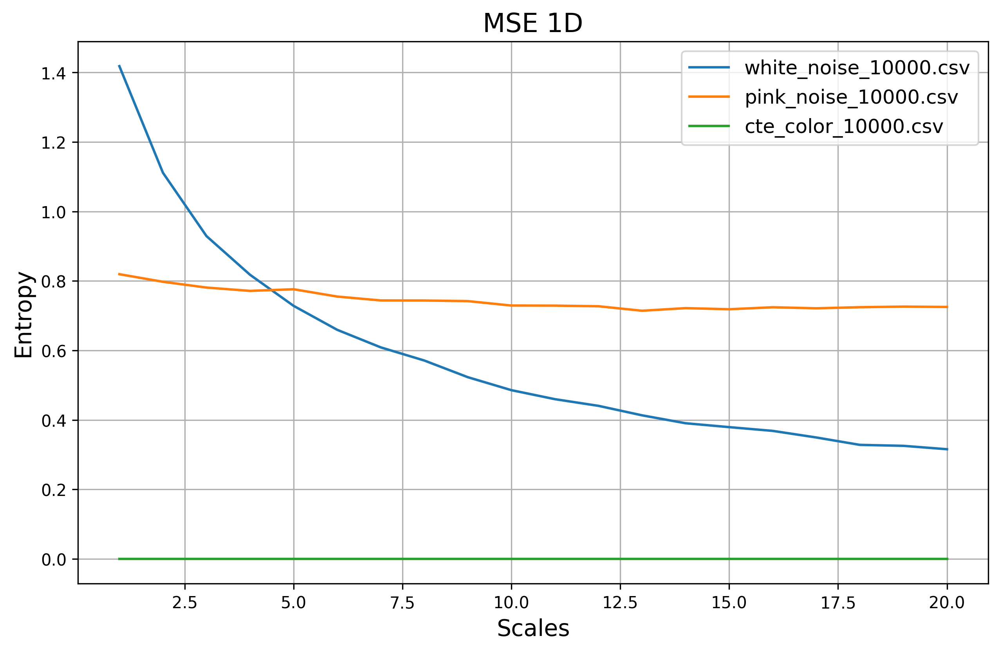

# About
[](https://colab.research.google.com/github/bcerdam/Multiscale_Entropy_id/blob/main/multiscale_entropy_id.py)


C implementation of the three-dimensional Multiscale Entropy algorithm for {paper1} and {paper2}. Implementation for one and two-dimensional Multiscale Entropy also included.

# Installation

## Step 1: Clone repo.

From a desired directory, do this:

```console
git clone https://github.com/bcerdam/Multiscale_Entropy_id.git
cd Multiscale_Entropy_id
python3 -m venv env
source ./env/bin/activate
pip install -v -e . 
```

## Step 2: Install requirements.

```console
pip install -r requirements.txt
```

## Step 3: Compile C code.

Should work out of the box for Ubuntu (gcc). It should also work for macOS, however, you need to set up ([Clang](https://clang.llvm.org/get_started.html)). Windows hasn't been tested, it probably doesn't work.

#### gcc
```console
gcc -o core_c/mse_1d/executables/mse_1d_p core_c/mse_1d/scripts/mse_1d.c core_c/mse_1d/scripts/read_csv.c core_c/mse_1d/scripts/signal_std.c core_c/mse_1d/scripts/utils.c  -lm -fopenmp -Icore_c/mse_1d/headers && \
gcc -o core_c/mse_2d/executables/mse_2d_p core_c/mse_2d/scripts/mse_2d.c core_c/mse_2d/scripts/read_csv.c core_c/mse_2d/scripts/utils.c  -lm -fopenmp -Icore_c/mse_2d/headers && \
gcc -o core_c/mse_3d/executables/mse_3d_p core_c/mse_3d/scripts/mse_3d.c core_c/mse_3d/scripts/read_csv.c core_c/mse_3d/scripts/signal_std.c core_c/mse_3d/scripts/utils.c -lm -fopenmp -Icore_c/mse_3d/headers
```

#### clang:
```console
clang -Xclang -fopenmp -I/usr/local/opt/libomp/include -L/opt/homebrew/Cellar/libomp/16.0.6/lib -lomp -Icore_c/mse_1d/headers core_c/mse_1d/scripts/mse_1d.c core_c/mse_1d/scripts/read_csv.c core_c/mse_1d/scripts/signal_std.c core_c/mse_1d/scripts/utils.c -o core_c/mse_1d/executables/mse_1d_p  && \
clang -Xclang -fopenmp -I/usr/local/opt/libomp/include -L/opt/homebrew/Cellar/libomp/16.0.6/lib -lomp -Icore_c/mse_2d/headers core_c/mse_2d/scripts/mse_2d.c core_c/mse_2d/scripts/read_csv.c core_c/mse_2d/scripts/utils.c -o core_c/mse_2d/executables/mse_2d_p  && \
clang -Xclang -fopenmp -I/usr/local/opt/libomp/include -L/opt/homebrew/Cellar/libomp/16.0.6/lib -lomp -Icore_c/mse_3d/headers core_c/mse_3d/scripts/mse_3d.c core_c/mse_3d/scripts/read_csv.c core_c/mse_3d/scripts/signal_std.c core_c/mse_3d/scripts/utils.c -o core_c/mse_3d/executables/mse_3d_p
```

# Examples.

Inside the script "multiscale_entropy_id.py", there are three code examples. These are useful to understand how the dimensions of the input need to be handled and formatted. (Remember to activate the virtual enviroment in your IDE)

If you want to run the algorithm through the terminal, do the following:

## MSE 1D:

```console
python3 multiscale_entropy_id.py --algorithm mse_1d --input examples/mse_1d/ --scales 20 --m 2 --r 0.2 --fuzzy True --method RCMSE --n_threads 8
```

Output:




## MSE 2D:

```console
python3 multiscale_entropy_id.py --algorithm mse_2d --input examples/mse_2d/ --scales 20 --m 2 --r 0.2 --fuzzy True --n_threads 8
```

Output:


## MSE 3D:

```console
python3 multiscale_entropy_id.py --algorithm mse_3d --input examples/mse_3d/ --scales 20 --m 2 --r 0.2 --fuzzy True --method RCMSE --n_threads 8
```

Output:


# License

No se cual, pero si alguien llega a ocupar esta herramienta, quiero que me llegue una citacion.
